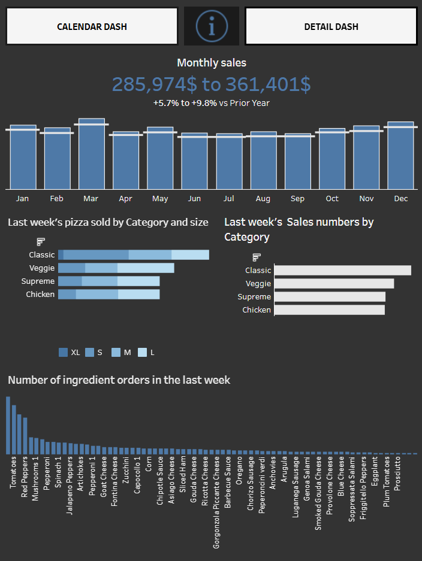
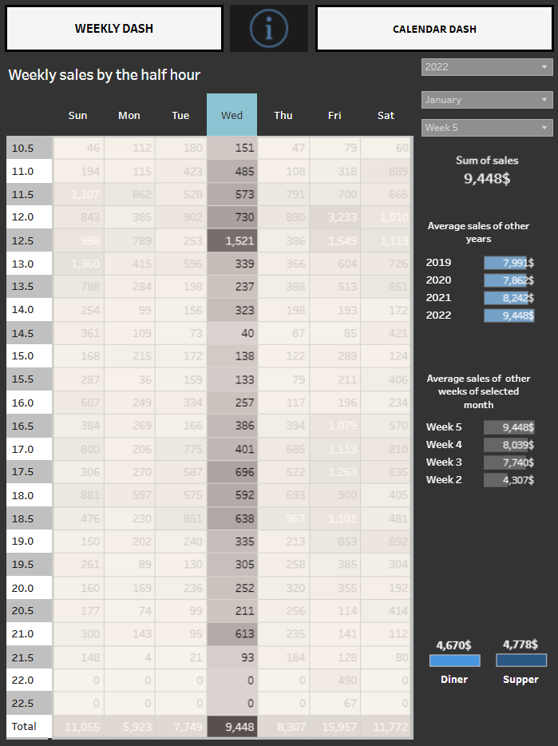
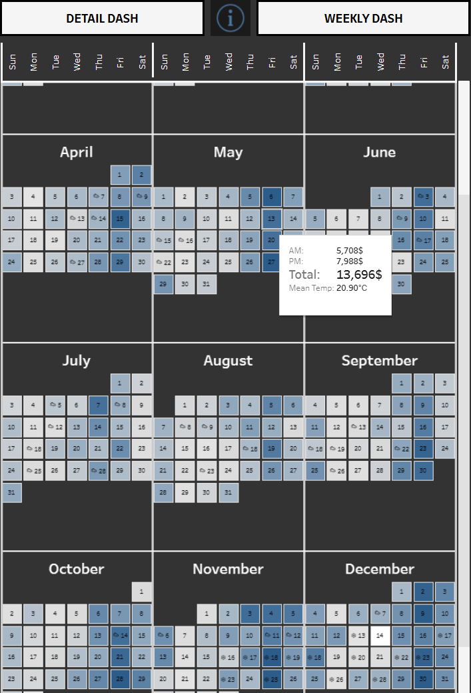

# Project summary

I have been in the buisiness management of a fast food restaurant for several years now and I have often felt like I was missing a clear portrait of several key metrics that could influence decisions and therefore limit wasted time and money.

This dashboard project constructed in **Tableau** aims to give a clear and efficient acces to different relevant sales metrics for a similar buisiness aiming to help decision makers.

Data for this project is a mix of anonymised and modified data, data from a pizzeria dataset on kaggles.com and of weather data taken from  https://climate-change.canada.ca/climate-data/#/daily-climate-data. 

Datasets have been modified using **python** to fit the context of this project and are in no way related to another. 


This project is meant as a demonstration of concepts.

*Link to the dashboard on tableau public*:

https://haproxy-traffic-splitter/views/Pizzeriasalesdashboards/Weeksummarydashboard?:language=en-US&:sid=&:redirect=auth&:display_count=n&:origin=viz_share_link

## Overview of the dashboards

### Weekly review Dashboard

</p align="center">



</p>

The first dashboard is meant as a weekly summary of the previous week.

- A global portrait of the last twelve months' sales is presented at the top with comparison to last year's sales to spot trends at a glance.

- A breakdown of last week's food items sold is then represented as a bar chart in sales numbers as well as in number of orders. Filters allow further inspection of a specific category by a simple clic in the bar graph.

- The last element of the dashboard is a collection of every ingredient orders from the last week. Spotting trends in ingredient order can greatly help in the management of inventory.

### Detailed view Dashboard

<p align="center">



</p>

The main element of this dashboard is a table of sales, filtered by the half hour. It's main use is as a small database of sales meant to help decision making regarding staff to be scheduled. Cost of staff is a main concern in the fast food industry. Predicting daily sales as well as periods of affluence can result in major cost savings.

Top right filters select a week of interest. Selecting a day of week then looks for all similar days that could provide information on trends.

### Calendar Dashboard

<p align="center">



</p>

The last dashboard aims at a broader view of the daily sales, giving a visual cue as to where the hot spots tend to be.

```Hue```: Hue of the boxes go darker as the sales increase to further spot trends and help predict future sales.

```Weather```: Weather tends to influence sales so monitoring past weather can explain trends in the data. Icons on the boxes help spot days of heavy rain or snow. 

## Notable tableau features

- Use of **pivot** functionnality to get a count of ingredients that where originaly given as a comma separated string of ingredients for each order.
- **Level of detail** expressions to get previous year and current year calculations.
- Use of imported icons for **info buttons**.
- **Dynamic filters.**
- Dashboard button navigation functionnality.


## Next step

- Adding an HR dashboard
